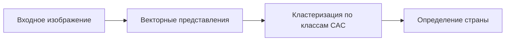

# Система распознавания стран по паспортам
Данный проект реализует систему распознавания страны выдачи паспорта по изображению его обложки с использованием техник контрастивного обучения. Решение обеспечивает 100% точность на тестовом наборе данных и поддерживает несколько бэкендов для оптимального выполнения в различных сценариях.

# Ключевые особенности
🚀 100% точность на тестовом наборе данных

⚡ Высокая производительность с поддержкой различных бэкендов

🧠 Контрастивное обучение для извлечения устойчивых признаков

🔧 Гибкие конвейеры обучения и оценки

📊 Комплексные инструменты тестирования

🖼️ Поддержка стандартных форматов изображений (JPG, PNG)

# Поддерживаемые коды стран:
UZB, BEL, BGR, BLR, CAN, CHL, DOM, ESP, EST, GBR, HUN, IDN, IRL, ITA, KAZ, KGZ, MDA, MEX, NLD, POL, SVK, SWE, USA

# Архитектура системы

Решение объединяет два современных подхода:

Кодирование изображений: Использует [OpenCLIP](https://github.com/tulip-berkeley/open_clip) (модификация где шло обучения в задачах image vs image text vs text image vs text, что позволяет эффективно использовать image encider в данной задаче) для извлечения визуальных признаков

Классификация: Реализует подход Class Anchor Clustering (CAC) из [cac-openset](https://github.com/dimitymiller/cac-openset)

Модель дообучается с использованием контрастивного обучения, которое:

* Создает семантически богатые векторные представления

* Максимизирует расстояние между классами

* Минимизирует расстояние внутри классов

* Формирует устойчивое пространство признаков для идентификации страны

# Поддерживаемые бэкенды
Система поддерживает несколько бэкендов для вывода:
* PyTorch
* ONNX Runtime
* TensorRT

# Производительность
### Скорость обработки (на одно изображение)
| Бэкенд | Фреймворк | Среднее время | Ускорение |
|---|---|---|---|
| Torch | PyTorch| 39.5 мс| 1x |
| ORT | ONNX | Runtime| 30.6 мс| 1.3x |
| TRT | TensorRT | N/A* | - |

*Примечание: Бэкенд TensorRT не удалось протестировать из-за конфликта провайдеров в ONNX Runtime (TensorrtExecutionProvider).*

# Точность
| Набор данных | Примеров | Точность|
|---|---|---|
| Тестовый | 23 страны | 100% |
| Валидационный | 23 страны | 100% |

# Использование
### Установка зависимостей
#### Локально
~~~
pip install -r requirements.txt
~~~

#### Из Docker
Билд
~~~
docker build -t cuda-app .
~~~
Запуск
~~~
docker run -itd --gpus all --name my-cuda-app cuda-app
~~~
Подключение
~~~
docker exec -it my-cuda-app bash
~~~

### Обучение модели
~~~
python train.py \
  путь/к/модели.pt \
  путь/к/тренировочным/данным \
  название_эксперимента \
  --epochs 20 \
  --batch-size 64 \
  --lr 0.001 \
  --image-size 224 224
~~~

### Создание словаря эмбеддингов
~~~
python build_dict.py \
  путь/к/обученной_модели.pt \
  torch \
  путь/к/словарю.pb \
  путь/к/данным_для_словаря
~~~

### Оценка модели
~~~
python evaluate.py \
  путь/к/обученной_модели.pt \
  ort \
  путь/к/словарю.pb \
  путь/к/тестовым/данным \
  --countries UZB KAZ KGZ RUS
  ~~~

### Распознавание страны

~~~
python predict.py \
  путь/к/обученной_модели.pt \
  trt \
  путь/к/словарю.pb \
  путь/к/изображению.jpg
~~~

# Настройка и расширение
### Добавление новых стран
* Создайте папку с кодом страны в датасете
* Добавьте минимум 100 изображений
* *Дообучите модель
* Дополните словарь ембедингов