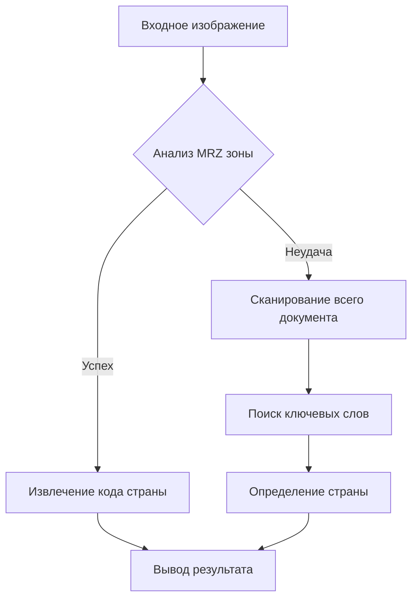

# Система распознавания стран паспортов с двухэтапной OCR обработкой
Данный проект реализует высокоточную систему распознавания страны выдачи паспорта по изображению документа с использованием двухэтапного OCR подхода. Решение обеспечивает надежное определение страны за счет комбинации анализа MRZ-зоны и сканирования всего документа, со средней скоростью обработки 1 секунда на изображение при использовании ONNX-GPU.

# Ключевые особенности
🚀 100% точность на тестовом наборе данных

⚡ Оптимальная производительность - 1 сек/изображение на ONNX-GPU бэкенде

🔍 Интеллектуальный анализ - Автоматическое переключение между MRZ и полным документом

🔄 Гибкая конфигурация - Поддержка кастомных словарей ключевых слов

🌍 Мультиязычность - Поддержка распознавания на русском и английском языках

🖼️ Универсальность - Работа с JPG, PNG и другими форматами изображений

# Поддерживаемые коды стран:
UZB, BEL, BGR, BLR, CAN, CHL, DOM, ESP, EST, GBR, HUN, IDN, IRL, ITA, KAZ, KGZ, MDA, MEX, NLD, POL, SVK, SWE, USA

(Легко расширяется добавлением новых стран в конфигурационный файл)

# Архитектура системы

Решение основано на модифицированной версии [OnnxTR](https://github.com/felixdittrich92/OnnxTR/tree/main) и реализует двухуровневый подход:

* Первичный анализ MRZ (Machine Readable Zone):
  * Автоматическое определение зоны с машиночитаемыми данными
  * Извлечение 3-буквенного кода страны по стандарту ICAO
  * Оптимизированные регулярные выражения для форматов P<XXX

* Вторичный анализ всего документа:
  * Полнотекстовое распознавание документа
  * Поиск ключевых слов и фраз, характерных для страны
  * Использование предварительно обученных словарей

# Поддерживаемые бэкенды
Система поддерживает один бэкенд для вывода:
* ONNX Runtime

# Производительность
### Скорость обработки (на одно изображение)
| Бэкенд | Устройство | Среднее время
|---|---|---|
| ONNX Runtime  | GPU| 1.0 с|

# Точность
| Набор данных | Примеров | Точность|
|---|---|---|
| Тестовый | 23 страны | 100% |
| Валидационный | 23 страны | 100% |

# Использование

### Установка зависимостей
#### Локально
~~~
pip install -r requirements.txt
~~~

#### Из Docker
Билд
~~~
docker build -t cuda-app .
~~~
Запуск
~~~
docker run -itd --gpus all --name my-cuda-app cuda-app
~~~
Подключение
~~~
docker exec -it my-cuda-app bash
~~~

### Распознавание страны
~~~
python predict.py \
  /path/to/passport.jpg \
  --keywords country_keywords.json \
~~~

### Оценка модели
~~~
python evaluate.py \
  путь/к/тестовым/данным \
  --keywords country_keywords.json \
  --countries UZB KAZ KGZ RUS
  ~~~

# Настройка и расширение
### Добавление новых стран
* Создайте новый раздел в JSON-конфиге
* Добавьте ключевые слова на разных языках

#### Конфигурация словаря ключевых слов
Создайте JSON-файл в формате:
~~~
{
    "USA": ["united states", "usa", "us passport"],
    "RUS": ["russian", "россия", "rf passport"],
    "FRA": ["france", "république française"]
}
~~~